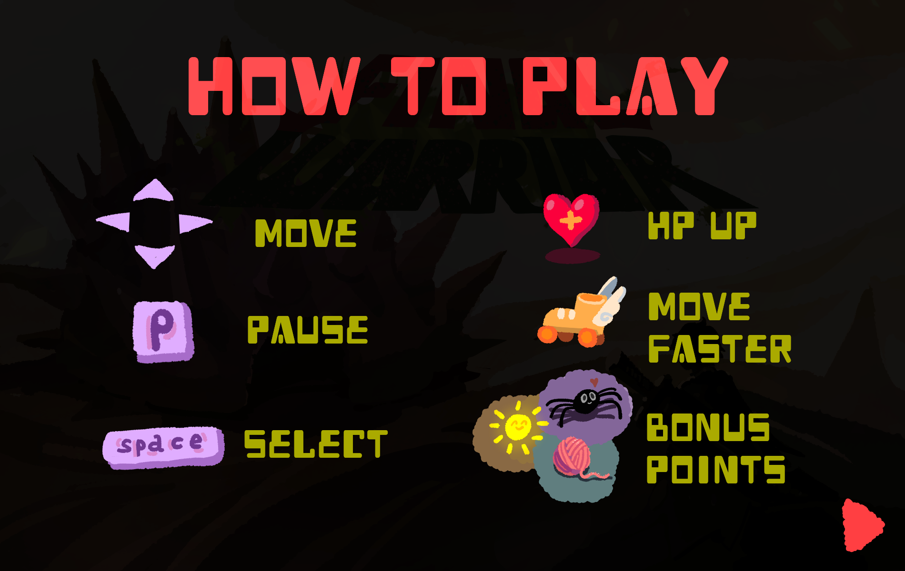
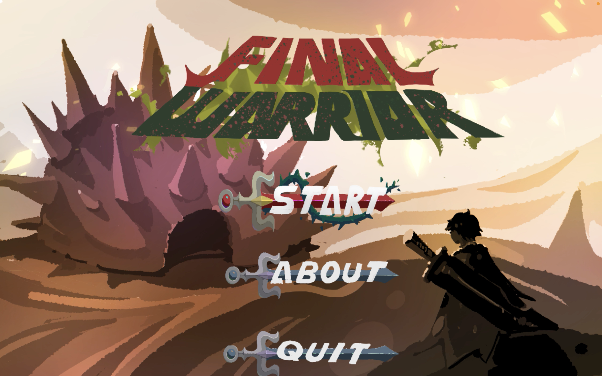
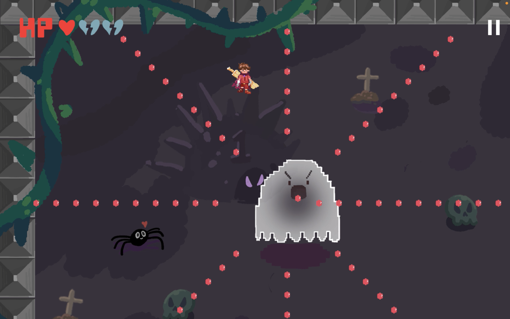
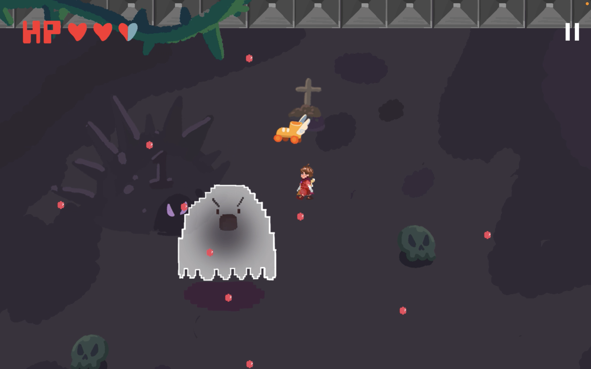
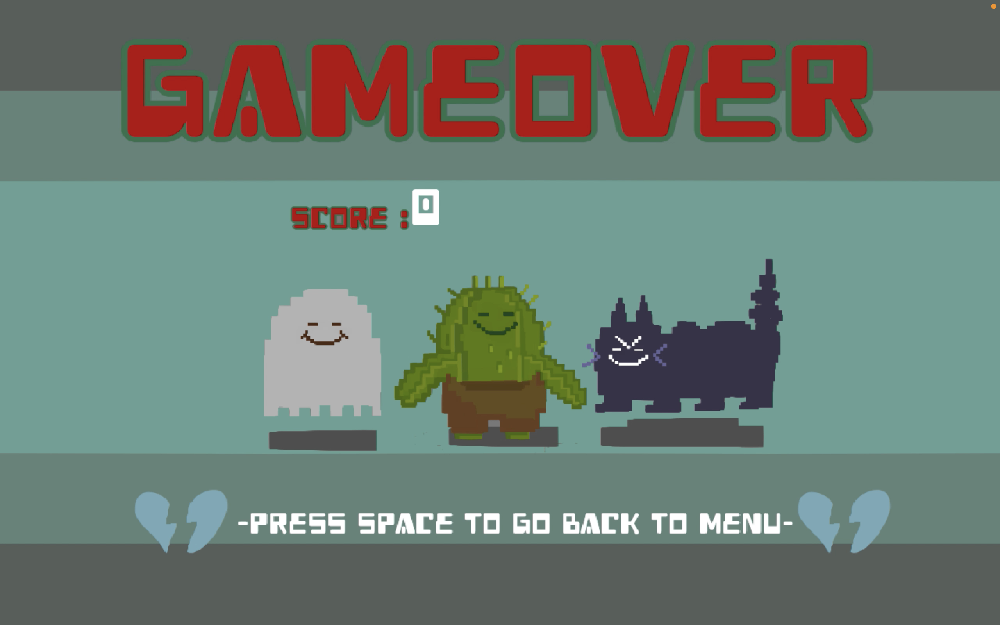
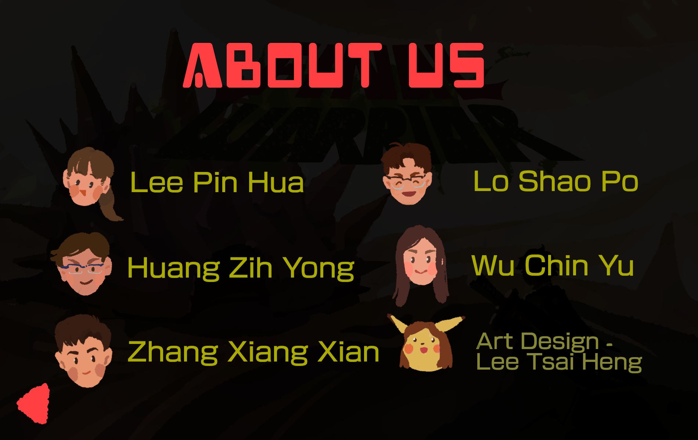

# :crossed_swords: Final Warrior :crossed_swords:
This is the 2D PC game for the final project of the class, Programming for Business Computing(108-2 PBC Spring), at Naional Taiwan University(NTU) instructed by Prof. Ling-Chieh Kung.

## Usage
1. clone this repo `git clone https://github.com/itsalicelee/Final-Warrior`
2. run the command `pip3 install pygame==2.0.0.dev6`
3. go the the src directory `cd src`
4. run the command `python3 main.py`, and enjoy! :partying_face:

## How to control
- Use the keyboard(**up**, **down**), press **space** to select
- Use **ESC** to quit the game or the quit the option page 
- Use **P** to pause the game or adjust volume

## Screenshots of the game

## About us
- Special thanks to Tsai-Heng Lee(stacy668149@gmail.com) for the amazing art design! :love_you_gesture:

## Demo Link
[Demo Link](https://www.youtube.com/watch?v=k-x5WQfzvZU)

